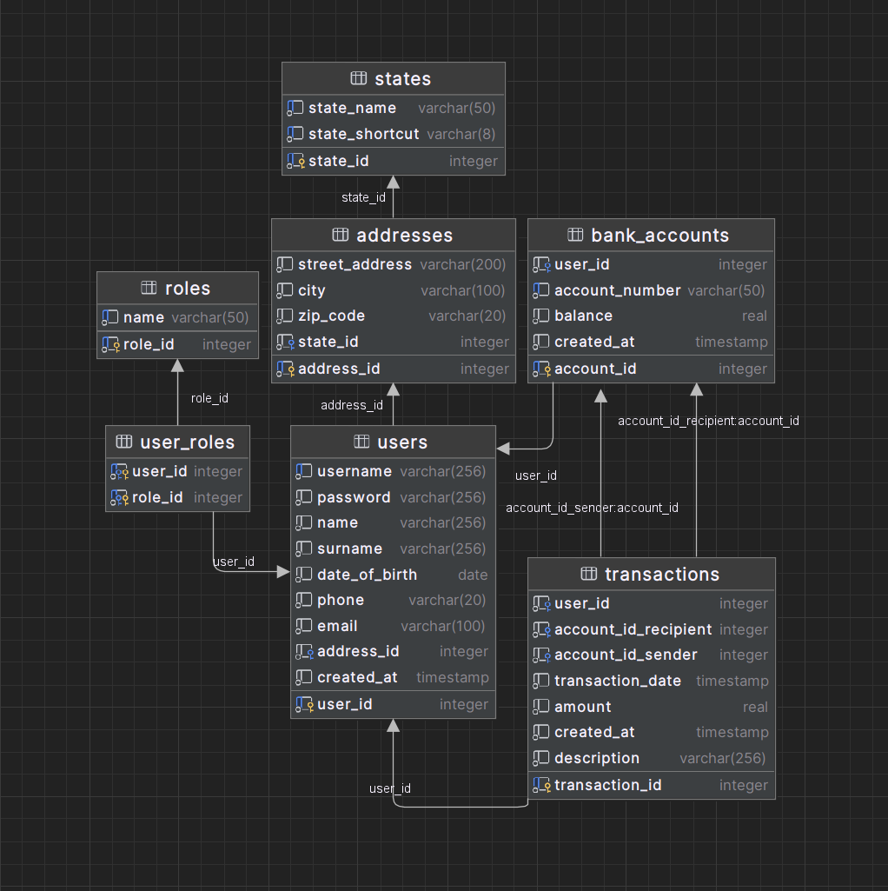

# I-Banking BE Application

The I-Banking BE Application is a backend server component for an I-Banking application. It provides the necessary APIs
and functionalities to support banking operations and user management.

## DB model

## API Endpoints

The following API endpoints are available in this application:

### Authentication

- **POST** `/auth/login`: Allows users to log in and obtain a JSON Web Token (JWT) for authentication.
- **POST** `/auth/register`: Allows users to register a new account.

### User Management

- **GET** `/user/find`: Retrieves user information by their username.
- **GET** `/user/accounts`: Retrieves the bank accounts associated with a user.

### Bank Account Management

- **GET** `/account/{accountId}/transactions`: Retrieves the transactions associated with a bank account.
- **POST** `/account/transaction/create`: Creates a new transaction.

For detailed information on each endpoint and its request/response payloads, please refer to the corresponding
controller classes in the source code.

### Security

This application implements authentication and authorization using JSON Web Tokens (JWT). Upon successful login, a JWT
token is generated and returned to the client. Subsequent requests to secure endpoints must include this token in the
Authorization header as follows: `Authorization: Bearer <token>`

Make sure to include the token in the header of each request to access protected endpoints.

### Error Handling

The application handles various error scenarios and returns appropriate HTTP status codes and error messages in the
response.

## Project Structure

- `configs` - Contains classes related to security configuration, such as authentication and authorization.
- `controllers` - Contains the API controller classes responsible for handling HTTP requests and defining the endpoints.
- `domains` - Contains the domain or entity classes that represent the core business objects in the application.
- `dtos` - Contains the DTO (Data Transfer Object) classes that define the data structures used for request and response
  payloads.
- `repositories` - Contains the repository interfaces that define the data access operations for the entities.
- `services` - Contains the service interfaces and their implementations that encapsulate the business logic and
  interact with the repositories.
- `utils` - Contains utility classes that provide common functionalities or helper methods.